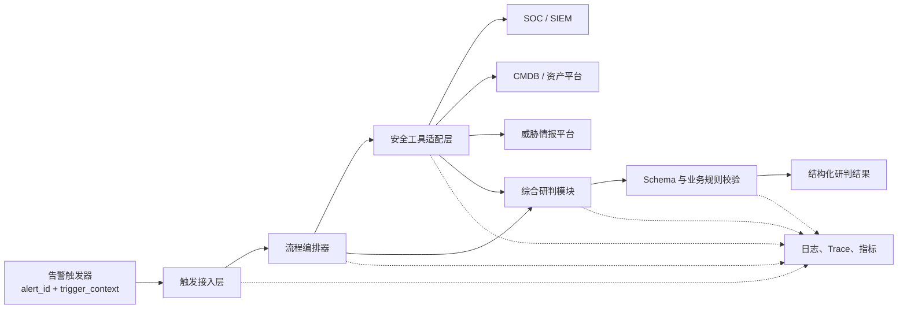
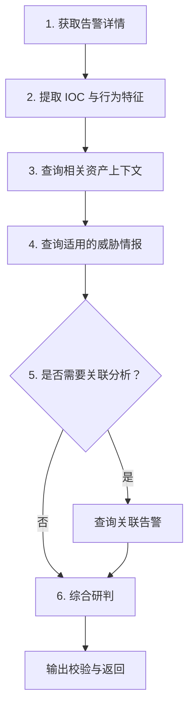

# 场景一 Agent 初始架构设计：安全告警分析

## 1. 文档目的

本文定义场景一 Agent 的初始架构边界，供前场人员设计和实现真实的告警分析流程。它规定输入、输出、工具接口、核心数据流以及与 Eval 测试集的兼容要求，但不指定必须使用哪一种 Agent 框架、工作流引擎、类结构或部署方式。

仓库中的 Python 代码是路线 A Eval Harness：它把测试集中的 mock 工具结果直接注入模型上下文，用于验证数据和评分链路，尚不包含生产 Agent 的真实工具调用循环。

## 2. 场景目标

Agent 接收 SOC/SIEM 推送的告警标识和触发上下文，补充告警详情、资产信息、威胁情报和关联告警，最后输出可验证的结构化研判结论与处置建议。

核心能力包括：

- 区分真实威胁、未遂攻击、低风险事件和误报；
- 给出严重级别、攻击类型、置信度、证据链和 IOC；
- 让每条关键结论都能追溯到工具返回数据；
- 提供按优先级排列、可直接执行的处置建议；
- 记录本次研判实际使用的标准工具 ID。

## 3. 范围与非目标

### 3.1 本设计覆盖

- 告警触发输入契约；
- 四类安全数据工具的逻辑接口；
- 六步告警研判流程；
- Agent 结构化输出契约；
- 失败处理、幂等、日志和可观测性要求；
- 真实 Agent 与现有 Eval Harness 的对接边界。

### 3.2 本设计不覆盖

- SOC、SIEM、CMDB、威胁情报平台的具体厂商接口；
- 生产鉴权、网络部署和权限审批流程；
- LLM、Agent 框架或工作流引擎选型；
- Prompt 的最终生产版本；
- 前端页面、告警推送渠道和人工审批界面；
- 场景二至场景四的实现。

## 4. 总体架构



架构由六个逻辑模块组成。前场可以合并或拆分物理服务，但每个职责边界应保持可测试。

| 模块 | 主要职责 | 输入 | 输出/依赖 |
|---|---|---|---|
| 触发接入层 | 接收告警、校验必填字段、生成 Trace ID、执行幂等检查 | `alert_id`、`trigger_context` | 标准化分析任务 |
| 流程编排器 | 决定工具调用顺序、条件分支、超时和重试 | 标准化任务、工具结果 | 完整研判上下文 |
| 安全工具适配层 | 隔离不同厂商 API，统一请求和返回结构 | 标准工具参数 | 标准化工具响应或结构化错误 |
| 综合研判模块 | 提取 IOC、交叉验证证据、生成结论和处置建议 | 告警、资产、情报、关联告警 | Agent 输出候选 JSON |
| 输出校验模块 | 校验 Schema、枚举、置信度、Tool ID 和建议完整性 | 输出候选 JSON | 合法 `AgentOutput` 或校验错误 |
| 可观测性模块 | 记录耗时、调用结果、重试、token 和错误摘要 | 全流程事件 | Trace、指标和脱敏日志 |

## 5. 输入契约

最小输入如下：

```json
{
  "alert_id": "ALT-20260710-0001",
  "trigger_context": "SOC 推送：核心主机出现异常登录告警"
}
```

| 字段 | 类型 | 必填 | 说明 |
|---|---|---:|---|
| `alert_id` | string | 是 | 告警在来源系统中的唯一标识，也是幂等键的核心组成部分 |
| `trigger_context` | string | 是 | 告警推送时附带的简要上下文，只用于启动分析，不能替代完整告警详情 |

生产实现可以增加租户、来源系统、时间戳和回调地址等字段，但不应改变这两个基础字段的语义。

## 6. 六步逻辑流程



### 6.1 获取告警详情

以 `alert_id` 查询完整事件，包括触发规则、原始日志、源/目的地址、时间和初始 IOC。该步骤是所有用例的基础，不应只依据 `trigger_context` 直接下结论。

### 6.2 提取 IOC 与行为特征

从告警详情中提取 IP、域名、文件哈希、URL，以及进程、端口、协议和操作行为。IOC 提取可以是确定性解析、模型解析或两者组合，但必须保留原始证据位置。

### 6.3 查询资产上下文

对与研判有关的内部 IP 查询资产归属、业务重要性、网络区域以及扫描器、堡垒机、蜜罐等身份。资产角色是判断影响范围和误报的重要依据。

### 6.4 查询威胁情报

对适用的 IP、域名、哈希或 URL 查询恶意性、信誉、威胁标签和关联组织。没有可查询 IOC 的用例不应为了满足固定流程而伪造查询参数。

### 6.5 条件查询关联告警

当关键资产受影响、IOC 已知恶意、单条证据不足、需要重建攻击链或判断行为是否持续时，查询指定时间窗口内的关联告警。是否调用应由上下文决定，并能在 Trace 中解释。

### 6.6 综合研判

结合告警详情、资产上下文、威胁情报和关联事件确定严重级别、攻击类型和置信度，生成证据链、IOC 列表及处置建议。证据不足时应降低置信度或明确不确定性，不得补造事实。

## 7. 工具接口契约

工具名属于 Eval 契约，必须使用下列精确 ID，不能翻译成中文、产品名或数据源名称。

### 7.1 `query_alert_detail`

```json
{"alert_id": "string"}
```

返回告警规则、原始日志、时间戳、源/目的网络信息、关键字段和初始 IOC。所有分析都应先获得告警详情。

### 7.2 `query_asset_info`

```json
{"ip": "string"}
```

返回主机、部门、业务系统、资产级别、网络区域和特殊角色标识。对多个相关内部 IP 可以分别调用。

### 7.3 `query_threat_intel`

```json
{
  "ioc_type": "ip|domain|hash|url",
  "ioc_value": "string"
}
```

返回恶意性、信誉分、威胁标签、关联组织、时间范围、来源和情报置信度。对多个 IOC 可以分别调用。

### 7.4 `query_related_alerts`

```json
{
  "ip": "string|null",
  "ioc_value": "string|null",
  "time_window_hours": 48
}
```

返回同一资产或 IOC 在时间窗口内的告警列表。该工具是条件调用，参数至少应包含一个可用于关联的 IP 或 IOC。

## 8. 输出契约

最终输出必须满足以下结构：

```json
{
  "alert_id": "ALT-20260710-0001",
  "judgment": {
    "severity": "critical|high|medium|low|false_positive",
    "attack_type": "brute_force|webshell|c2_communication|data_exfiltration|phishing|scanning|ransomware|credential_dump|exploitation|container_escape|supply_chain|arp_spoofing|iot_anomaly|vpn_anomaly|insider_threat|none|other",
    "confidence": 0.91,
    "summary": "一句话研判结论",
    "evidence_chain": ["能够在工具结果中定位的证据"],
    "iocs": [
      {
        "type": "ip|domain|hash|url",
        "value": "192.0.2.10",
        "malicious": true,
        "context": "IOC 的证据来源与作用"
      }
    ]
  },
  "remediation": ["按优先级排列、对象和动作明确的处置建议"],
  "metadata": {
    "tools_called": ["query_alert_detail", "query_asset_info"]
  }
}
```

约束如下：

- `alert_id` 必须与输入一致；
- `confidence` 是 0 到 1 的数值，不能使用布尔值或百分数字符串；
- `evidence_chain` 中每条事实必须能追溯到本次工具结果；
- `remediation` 至少一条，必须包含明确对象、动作和优先级；
- `metadata.tools_called` 只列本次实际使用的标准工具 ID；
- 误报使用 `severity=false_positive` 和 `attack_type=none`。

## 9. 严重级别参考

| 级别 | 参考含义 |
|---|---|
| `critical` | 已确认成功入侵、核心资产已受影响，或需要立即启动应急响应 |
| `high` | 高度疑似入侵、关键资产面临直接威胁，但尚缺少确认成功影响的证据 |
| `medium` | 存在可疑或恶意行为，但影响受限、攻击未遂或证据不足以升级 |
| `low` | 信息级事件、低风险行为或已被防护措施有效阻断且无后续影响 |
| `false_positive` | 已由资产身份、业务变更、计划任务或其他可信上下文确认为误报 |

严重度不能只依据原始告警级别或单一 IOC 情报确定，应同时考虑是否成功、资产重要性、影响范围和关联行为。

## 10. 异常处理与运行约束

### 10.1 超时与重试

- 网络超时、限流和服务端临时错误可以有限重试，并采用退避；
- 鉴权失败、参数不合法和明确的业务拒绝不应盲目重试；
- 重试必须保留同一个 Trace ID，并记录尝试次数和最终状态；
- 工具超时上限和全任务超时上限应分别配置。

### 10.2 部分工具失败

- 告警详情失败时无法形成可靠研判，应返回结构化失败，不得只依据推送摘要猜测；
- 非基础工具失败时，可以在证据充分的情况下继续，但必须降低置信度并记录缺失来源；
- 不得把“查询失败”解释为“没有风险”或“没有关联告警”。

### 10.3 幂等

建议使用 `来源系统 + alert_id + 分析版本` 作为幂等键。重复推送可以复用已完成结果；配置、Prompt、模型或数据版本变化时应生成新的分析版本。

### 10.4 日志与安全

- 全流程使用同一 Trace ID 串联触发、工具和模型调用；
- 记录工具名、耗时、状态和脱敏错误摘要，不记录 API Key、Authorization 或无关敏感原文；
- 模型配置、Prompt 版本和工具返回版本应可追溯；
- 面向前端的错误信息与内部诊断信息分离。

## 11. 与现有 Eval Harness 的对接

### 11.1 当前路线 A

现有 Harness 从 `Eval-data_v1.json` 读取 `trigger_context` 和 `mock_api_responses`，把 mock 结果作为“已查询信息”注入 Prompt，然后调用一次模型生成 `AgentOutput`。因此它验证的是输入输出契约、研判能力和评分体系，不验证真实工具选择、参数生成或多轮编排。

### 11.2 前场接入方式

前场可以保留数据加载和 Grader，把 Harness 中“Prompt Builder + 单次模型调用”的生成阶段替换成真实 Agent 执行器。真实执行器至少需要返回同一 `AgentOutput`，并将真实工具 Transcript 映射到标准 Tool ID。

迁移时应保持：

- `Eval-data_v1.json` 的用例身份和 Ground Truth 语义；
- `AgentOutput` Schema；
- 四个标准工具 ID；
- 6 个 Code Grader 的含义；
- Model Grader 的输入证据边界；
- 每条用例隔离、checkpoint 和可恢复运行能力。

前场可以自主决定：

- 使用线性工作流、状态机或 Agent loop；
- IOC 提取使用规则、模型或混合方式；
- 工具并行策略和缓存；
- 模型与 Prompt 的具体实现；
- 是否增加人工审批节点。

## 12. 前场实现验收清单

- [ ] 输入能够接收 `alert_id` 和 `trigger_context`；
- [ ] 四个工具通过适配层暴露为标准 Tool ID；
- [ ] `query_related_alerts` 是有依据的条件调用；
- [ ] 输出通过 `AgentOutput` Schema 校验；
- [ ] 严重度不是只检查枚举，而是能与 Ground Truth 计算准确率；
- [ ] 证据链可以追溯到工具结果；
- [ ] 工具失败不会被当作无风险证据；
- [ ] 日志和报告不包含 API Key；
- [ ] 修改后 75 个离线测试仍通过；
- [ ] 先跑单条和 3 条冒烟，再运行 30 条全量 Eval。
